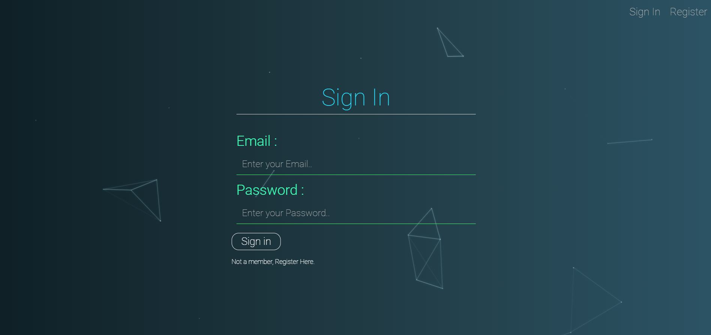
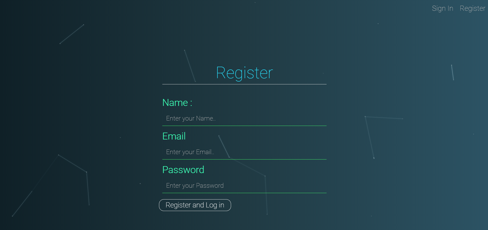
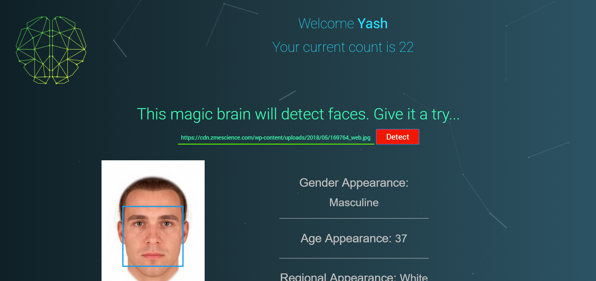

# Face Recognizer
This app is used to detect the facial location of a person in a image. For this you have to paste the online link of the image. 
This app will then detect the face and will predict the gender, region and age. Don't be afraid if it judges you older than you are :) coz it is just a machine.  
To use this app you first have to register yourself and then you can sign-in easily by providing your valid credentials 
I have used the Clarify Api for face detection which uses the machine learning algorithm to provide us the predicted information. 
#
Following is the overview of the app...
#
# SignIp Page

#
# Registration Page

#
#Cover Page

